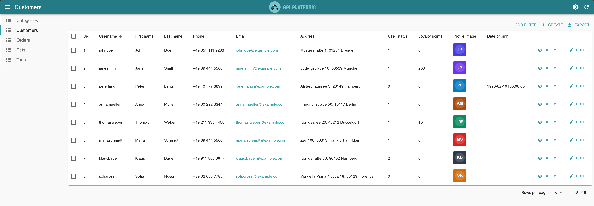
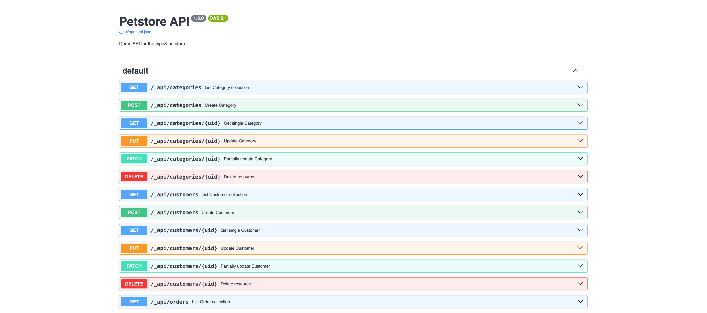

# TYPO3 Petstore

A demo TYPO3 extension and showcase dataset for [maikschneider/tca-api](https://github.com/maikschneider/tca-api). Install it, run
`ddev init-typo3`, and a fully wired Petstore API with an [API Platform Admin](https://api-platform.com/docs/admin/) frontend is ready in
seconds.



## API endpoints

Five resources, full CRUD, all public. API prefix: `/_api/` (configurable via the TCA API site set).

| Endpoint                | `GET` | `POST` | `PUT`  | `DELETE` |
|-------------------------|-------|--------|--------|----------|
| `/_api/pets`            | list  | create | —      | —        |
| `/_api/pets/{id}`       | show  | —      | update | delete   |
| `/_api/categories`      | list  | create | —      | —        |
| `/_api/categories/{id}` | show  | —      | update | delete   |
| `/_api/tags`            | list  | create | —      | —        |
| `/_api/tags/{id}`       | show  | —      | update | delete   |
| `/_api/orders`          | list  | create | —      | —        |
| `/_api/orders/{id}`     | show  | —      | update | delete   |
| `/_api/customers`       | list  | create | —      | —        |
| `/_api/customers/{id}`  | show  | —      | update | delete   |

All responses are Hydra JSON-LD. Interactive docs: [`/_api/swagger-ui`](https://typo3-petstore.ddev.site/_api/swagger-ui)



## Demo setup

Clone this repository and install dependencies:

```bash
ddev start
ddev composer install
ddev init-typo3
```

`init-typo3` sets up a fresh TYPO3 installation and imports all demo fixtures. After that the API and the Admin UI are immediately usable.

**Credentials:** `admin` / `Passw0rd!`

## License

GPL-2.0-or-later
